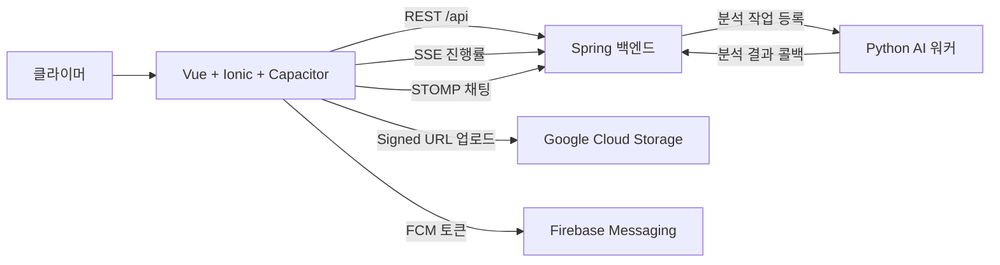

# Hola (올라) — 모바일 클라이언트

> Vue 3, Ionic Vue, Capacitor로 만든 Hola 클라이밍 영상 SNS 클라이언트입니다.
> SSAFY 자율 프로젝트 · 2026-05-15 ~ 2026-06-25 · 발표 이후 개인 고도화 중

<p align="center">
  
</p>

## 관련 링크

- [조직 프로필](https://github.com/hola-climb)
- [백엔드 서버](https://github.com/hola-climb/hola-climbing-server)
- [AI 분석 워커](https://github.com/hola-climb/hola-climbing-ai)

## 이 앱의 역할

`hola-climbing-web`은 Hola의 모바일 중심 클라이언트입니다. 사용자는 이 앱에서 클라이밍 영상을 올리고,
개인화 피드를 탐색하고, AI 분석 결과를 확인하고, 클라이밍 기록을 남기고, 암장을 탐색하고,
알림과 이메일/OAuth 인증 흐름을 사용할 수 있습니다.

앱은 먼저 웹 앱으로 동작하고, Capacitor를 통해 네이티브 모바일 앱으로 패키징됩니다.
백엔드는 인증, 도메인 데이터, 영상 메타데이터, 추천, 채팅, AI 분석 작업 등록을 담당합니다.
Python AI 워커는 영상 분석을 담당합니다. 이 클라이언트는 REST, SSE, STOMP, 푸시 메시징으로
각 시스템을 연결합니다.

## 주요 화면과 라우트

| 영역 | 라우트 | 사용자가 하는 일 |
|---|---|---|
| 피드 | `/feed`, `/videos/:id` | 개인화 클라이밍 영상을 보고, 상세 화면에서 좋아요/댓글/신고/AI 분석 결과를 확인합니다. |
| 업로드 | `/upload` | 영상을 선택하고 FFmpeg.wasm으로 트리밍한 뒤, 백엔드가 발급한 GCS Signed URL 흐름으로 업로드합니다. |
| 기록 | `/records`, `/climbing-log`, `/records/report` | 클라이밍 로그를 작성하고, 달력 기록과 월간 리포트를 확인합니다. |
| 암장 탐색 | `/explore`, `/gyms/:id`, `/gyms/:id/videos` | 암장을 검색하고, 지도/상세/리뷰를 확인하고, 암장별 영상을 탐색합니다. |
| 마이페이지 | `/my`, `/my/videos`, `/my/notifications`, `/my/settings`, `/my/favorites`, `/my/blocks` | 프로필, 내 영상, 알림, 설정, 즐겨찾기, 차단 사용자를 관리합니다. |
| 인증 | `/auth/login`, `/auth/register`, `/auth/password-reset`, `/oauth/callback`, `/verify-email`, `/auth/social-signup` | 이메일 로그인/회원가입, 소셜 OAuth 콜백, 이메일 인증, 소셜 최초 가입을 처리합니다. |
| 사용자 프로필 | `/users/:id`, `/users/:id/follows` | 다른 클라이머의 프로필과 팔로잉/팔로워 목록을 확인합니다. |
| 관리자 | `/admin` | 관리자 전용 운영 UI에 접근합니다. |

## 클라이언트 아키텍처



주요 클라이언트 설계 결정:

- 로컬 웹 개발에서는 `/api`와 Vite proxy를 사용해 백엔드 요청을 보냅니다.
- 네이티브 Capacitor 빌드에서는 브라우저 개발 proxy가 없으므로 `VITE_API_BASE_URL`을 사용합니다.
- 백엔드의 `ApiResponse<T>` 래퍼는 `src/services/client.ts`에서 풀어 각 서비스가 실제 데이터만 받도록 합니다.
- 만료된 access token은 한 번만 refresh합니다. 로그인/회원가입/refresh 엔드포인트에는 오래된 bearer token을 일부러 붙이지 않습니다.
- 브라우저에서 영상 트리밍을 실행할 수 있도록 dev/build 전에 FFmpeg core 파일을 `public/ffmpeg`로 복사합니다.
- PWA service worker는 `/api/**`에 navigation fallback을 적용하지 않아 백엔드 OAuth redirect가 SPA에 먹히지 않도록 합니다.

## 기술 스택

| 구분 | 기술 |
|---|---|
| 앱 | Vue 3, Vite 5, TypeScript 5.9, Ionic Vue 8, Vue Router, Pinia |
| 네이티브 | Capacitor 8, iOS, Camera, Geolocation, Haptics, Keyboard, Status Bar |
| 미디어 | `@ffmpeg/ffmpeg`, `@ffmpeg/core`, local `capacitor-hola-sse` plugin |
| 네트워크 | Axios, SSE, STOMP (`@stomp/stompjs`) |
| 푸시 | Firebase, `@capacitor-firebase/messaging` |
| PWA | `vite-plugin-pwa`, Workbox |
| 관측 | Grafana Faro web SDK |
| 테스트 | Vitest, Vue Test Utils, Cypress, vue-tsc, ESLint |

## 빠른 시작

의존성을 설치합니다.

```bash
npm install
```

Vite 개발 서버를 실행합니다.

```bash
npm run dev
```

`npm run dev`는 `predev`를 먼저 실행해 FFmpeg worker asset을 `public/ffmpeg`로 복사합니다.

로컬 개발 서버는 아래 경로를 운영 백엔드로 proxy합니다.

| 경로 | 대상 |
|---|---|
| `/api` | `https://www.hola-climb.app` |
| `/videos` | `https://www.hola-climb.app` |

## 환경 변수

웹 개발에서는 Vite proxy를 사용하므로 API 호출은 `/api`로 보냅니다.

네이티브 Capacitor 빌드에서는 아래 값을 설정합니다.

```bash
VITE_API_BASE_URL=https://www.hola-climb.app/api
```

런타임 API base URL 선택은 `src/services/client.ts`에 있습니다.

```ts
const API_BASE = Capacitor.isNativePlatform() ? import.meta.env.VITE_API_BASE_URL : "/api";
```

## 스크립트

| 명령 | 용도 |
|---|---|
| `npm run dev` | FFmpeg asset을 복사하고 Vite 개발 서버를 실행합니다. |
| `npm run build` | FFmpeg asset을 복사하고 `vue-tsc`와 프로덕션 빌드를 실행합니다. |
| `npm run preview` | 프로덕션 빌드를 로컬에서 미리 봅니다. |
| `npm run test:unit` | Vitest 단위 테스트를 실행합니다. |
| `npm run test:e2e` | Cypress e2e 테스트를 실행합니다. |
| `npm run lint` | ESLint를 실행합니다. |
| `npm run copy:ffmpeg` | FFmpeg core JS/WASM asset을 `public/ffmpeg`로 복사합니다. |

## 모바일/네이티브 참고

Capacitor 설정:

| 항목 | 값 |
|---|---|
| 앱 ID | `com.hola.climbing` |
| 앱 이름 | `올라` |
| 웹 디렉토리 | `dist` |
| Android 스킴 | `https` |

네이티브 빌드 주의사항:

- `VITE_API_BASE_URL`은 백엔드 API base URL을 가리켜야 합니다.
- 네이티브 SSE 동작을 더 세밀하게 제어해야 하는 곳에서는 custom `capacitor-hola-sse` plugin을 사용합니다.
- Firebase messaging은 플랫폼별 설정이 필요하며, 이 README에서는 세부 설정을 다루지 않습니다.
- Camera/geolocation 권한은 Capacitor plugin과 네이티브 프로젝트 설정을 통해 처리합니다.

## 검증

클라이언트 변경을 공개하기 전에 아래 기본 검사를 실행합니다.

```bash
npm run lint
npm run test:unit
npm run build
```

브라우저 수준 흐름을 확인할 때는 Cypress를 실행합니다.

```bash
npm run test:e2e
```

현재 로컬 테스트는 영상 트리밍 helper, router/auth 동작, 이메일 인증 페이지를 포함합니다.

## 저장소 구조

```text
hola-climbing-web/
├── src/
│   ├── components/        # 공통 UI, 영상 컴포넌트, 암장/통계 위젯
│   ├── composables/       # OAuth, 위치, Kakao map, 영상 트리밍, 미디어 쿼리 helper
│   ├── layouts/           # 앱 탭 레이아웃과 인증 레이아웃
│   ├── pages/             # 피드, 업로드, 기록, 탐색, 마이, 인증, 관리자 페이지
│   ├── router/            # 라우트 테이블과 인증/관리자 guard
│   ├── services/          # API client, auth, video, gym, chat, stats, push, observability
│   ├── stores/            # Pinia stores
│   ├── types/             # 공통 API 타입과 Kakao 타입
│   └── utils/             # API 오류, 난이도 색상, 태그 라벨, 영상 트리밍 helper
├── local-plugins/
│   └── capacitor-hola-sse/
├── public/
├── tests/
│   ├── e2e/
│   └── unit/
├── capacitor.config.ts
├── vite.config.ts
└── package.json
```

## 상태

이 저장소는 Hola SSAFY 자율 프로젝트의 공개 클라이언트 코드입니다.
프로젝트는 2026-05-15부터 2026-06-25까지 개발되었고, 현재는 발표 이후 개인 고도화와 안정화 작업을 이어가고 있습니다.

이 README는 근거 자료가 붙어 있지 않은 운영 트래픽, 사용자 수, 매출, QPS, 모델 정확도 수치를 의도적으로 적지 않습니다.
