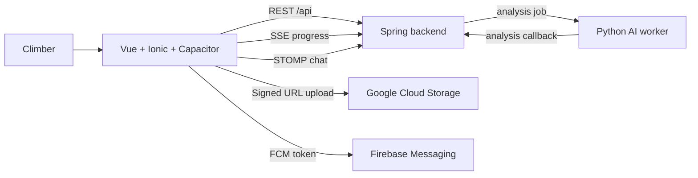

# Hola (올라) — Mobile Client

> Vue 3, Ionic Vue, and Capacitor client for the Hola climbing video SNS.
> SSAFY 자율 프로젝트 · 2026-05-15 ~ 2026-06-25 · 발표 이후 개인 고도화 중

<p align="center">
  
</p>

## Links

- [Organization profile](https://github.com/hola-climb)
- [Backend server](https://github.com/hola-climb/hola-climbing-server)
- [AI worker](https://github.com/hola-climb/hola-climbing-ai)

## What This App Does

`hola-climbing-web` is the mobile-first client for Hola, an AI-assisted climbing video SNS.
The app lets climbers upload videos, watch a recommendation feed, review AI analysis results,
track climbing logs, explore gyms, receive notifications, and move through OAuth/email auth flows.

The client is built as a web app first, then packaged for native mobile with Capacitor.
The backend owns domain state, authentication, video metadata, recommendations, chat, and AI analysis dispatch.
The Python worker owns video analysis. This client coordinates those systems through REST, SSE, STOMP, and push messaging.

## Product Surfaces

| Area | Routes | What the user does |
|---|---|---|
| Feed | `/feed`, `/videos/:id` | Browse personalized climbing videos, open details, like/comment, report content, view AI analysis. |
| Upload | `/upload` | Select video, trim it with FFmpeg.wasm, upload through backend-issued GCS Signed URL metadata flow. |
| Records | `/records`, `/climbing-log`, `/records/report` | Create climbing logs, inspect calendar records, read monthly reports. |
| Explore | `/explore`, `/gyms/:id`, `/gyms/:id/videos` | Search gyms, view maps/details/reviews, browse videos from a gym. |
| My | `/my`, `/my/videos`, `/my/notifications`, `/my/settings`, `/my/favorites`, `/my/blocks` | Manage profile, videos, notifications, settings, favorites, blocked users. |
| Auth | `/auth/login`, `/auth/register`, `/auth/password-reset`, `/oauth/callback`, `/verify-email`, `/auth/social-signup` | Email login/signup, social OAuth callback, email verification, first social signup. |
| Social profile | `/users/:id`, `/users/:id/follows` | View other climbers and follow/follower lists. |
| Admin | `/admin` | Admin-only operational UI. |

## Client Architecture



Key client decisions:

- Web requests use `/api` and Vite proxy during local development.
- Native Capacitor builds use `VITE_API_BASE_URL` because there is no browser dev proxy.
- API responses are unwrapped from the backend `ApiResponse<T>` wrapper in `src/services/client.ts`.
- Expired access tokens are refreshed once; login/signup/refresh endpoints deliberately skip stale bearer tokens.
- FFmpeg core files are copied to `public/ffmpeg` before dev/build so video trimming can run in the browser.
- The PWA service worker denies navigation fallback for `/api/**` so backend OAuth redirects are not swallowed by the SPA.

## Tech Stack

| Area | Technology |
|---|---|
| App | Vue 3, Vite 5, TypeScript 5.9, Ionic Vue 8, Vue Router, Pinia |
| Native | Capacitor 8, iOS, Camera, Geolocation, Haptics, Keyboard, Status Bar |
| Media | `@ffmpeg/ffmpeg`, `@ffmpeg/core`, local `capacitor-hola-sse` plugin |
| Network | Axios, SSE, STOMP (`@stomp/stompjs`) |
| Push | Firebase, `@capacitor-firebase/messaging` |
| PWA | `vite-plugin-pwa`, Workbox |
| Observability | Grafana Faro web SDK |
| Tests | Vitest, Vue Test Utils, Cypress, vue-tsc, ESLint |

## Quick Start

Install dependencies:

```bash
npm install
```

Start the Vite dev server:

```bash
npm run dev
```

`npm run dev` runs `predev`, which copies FFmpeg worker assets into `public/ffmpeg`.

The local dev server proxies:

| Path | Target |
|---|---|
| `/api` | `https://www.hola-climb.app` |
| `/videos` | `https://www.hola-climb.app` |

## Environment

For web development, the app uses the Vite proxy and sends API calls to `/api`.

For native Capacitor builds, set:

```bash
VITE_API_BASE_URL=https://www.hola-climb.app/api
```

The runtime selection lives in `src/services/client.ts`:

```ts
const API_BASE = Capacitor.isNativePlatform() ? import.meta.env.VITE_API_BASE_URL : "/api";
```

## Scripts

| Command | Purpose |
|---|---|
| `npm run dev` | Copy FFmpeg assets and run Vite dev server. |
| `npm run build` | Copy FFmpeg assets, run `vue-tsc`, and build production assets. |
| `npm run preview` | Preview the production build locally. |
| `npm run test:unit` | Run Vitest unit tests. |
| `npm run test:e2e` | Run Cypress e2e tests. |
| `npm run lint` | Run ESLint. |
| `npm run copy:ffmpeg` | Copy FFmpeg core JS/WASM assets into `public/ffmpeg`. |

## Mobile / Native Notes

Capacitor config:

| Field | Value |
|---|---|
| App ID | `com.hola.climbing` |
| App name | `올라` |
| Web directory | `dist` |
| Android scheme | `https` |

Native-specific concerns:

- `VITE_API_BASE_URL` must point to the backend API base URL.
- The custom `capacitor-hola-sse` plugin is used where native SSE behavior needs extra control.
- Firebase messaging requires platform-specific setup outside this README.
- Camera/geolocation permissions are handled through Capacitor plugins and native project configuration.

## Testing

Run the core checks before publishing client changes:

```bash
npm run lint
npm run test:unit
npm run build
```

Run Cypress when checking browser-level flows:

```bash
npm run test:e2e
```

Current local test surfaces include video trim helpers, router/auth behavior, and email verification page coverage.

## Repository Structure

```text
hola-climbing-web/
├── src/
│   ├── components/        # shared UI, video components, gym/stat widgets
│   ├── composables/       # OAuth, geolocation, Kakao map, video trim, media query helpers
│   ├── layouts/           # app tab layout and auth layout
│   ├── pages/             # feed, upload, records, explore, my, auth, admin pages
│   ├── router/            # route table and auth/admin guards
│   ├── services/          # API client, auth, video, gym, chat, stats, push, observability
│   ├── stores/            # Pinia stores
│   ├── types/             # shared API and Kakao types
│   └── utils/             # API errors, grade colors, tag labels, video trim helpers
├── local-plugins/
│   └── capacitor-hola-sse/
├── public/
├── tests/
│   ├── e2e/
│   └── unit/
├── capacitor.config.ts
├── vite.config.ts
└── package.json
```

## Status

This repository is the public client code for the Hola SSAFY autonomous project.
The project was built from 2026-05-15 to 2026-06-25 and is now maintained as a post-presentation hardening project.

This README avoids production traffic, user count, revenue, QPS, and model-accuracy claims unless source evidence is attached.
